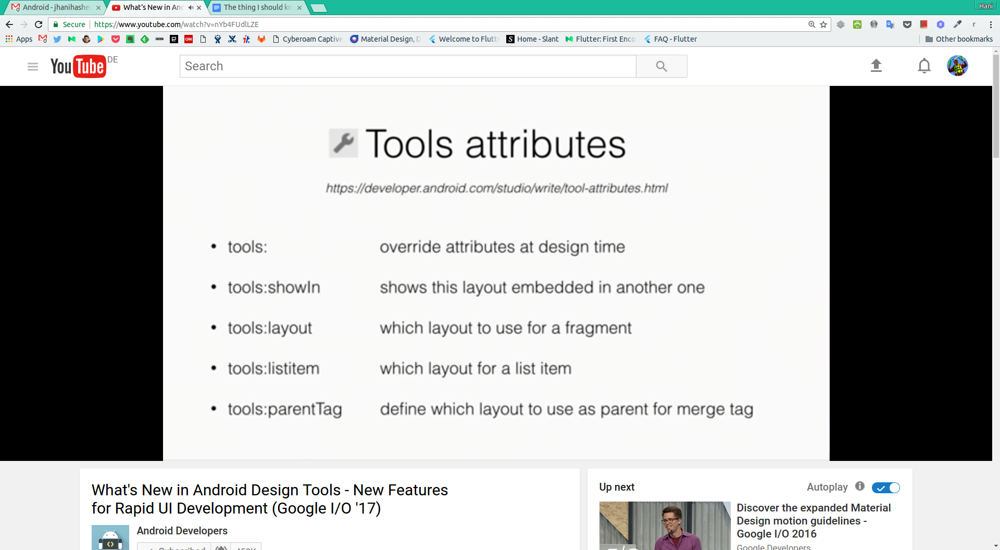

Be a Software Engineer

Table Content

[[TOC]]

# Something Basic

## Minimum Viable Product(MVP)

Is a product with just enough features to gather validated learning about the product and its continued development.

## Inversion of Control (IoC)

Inversion of control is a pattern used for decoupling components and layers in the system. The pattern is implemented through injecting dependencies into a component when it is constructed. These dependences are usually provided as interfaces for further decoupling and to support testability

## Dependency Injection (DI)

Is basically providing the objects that an object needs (its dependencies) instead of having it construct them itself. Dependencies can be injected into objects by many means (such as constructor injection or setter injection).

## Gradle

Is an open source build automation system that builds upon the concepts of Apache Ant and Apache Maven and introduces a Groovy-based domain-specific language (DSL) instead of the XML form used by Apache Maven of declaring the project configuration.

## Maven

Maven can manage a project's build, reporting and documentation from a central piece of information. In other hand I can say it is like Gradle.

## Artifact

In Maven terminology, the artifact is the resulting output of the maven build, generally a jar , war , aar or other executable files.

## JAR

**J**ava **AR**chive is a package file format typically used to aggregate many Java class files and associated metadata into one file for distribution.

## AAR

**A**ndroid **AR**chive is similar to JAR with added functionality. Unlike JAR files, AAR files can contain Android resources and a manifest file, which allows you to bundle in shared resources like layouts and drawable in addition to Java classes and methods.

## Package by features

Packaging stuff together by what it is, and not by what it does, will only make you jump 10 times to the place you are looking for.

Links:

* [Package by features, not layers](https://medium.com/@cesarmcferreira/package-by-features-not-layers-2d076df1964d#.3f1p7l1cu)

## MangoDB

is an open-source document database and leading NoSQL database. MangoDB is written in C++.

* **Database: **is a physical container for collections. Like Database in RDBMS

* **Collection: **is a group of MangoDB documents. Like Table in RDBMS

* **Document: **is a set of key-value pairs. Like Row in RDBMS

More information:[ https://www.tutorialspoint.com/mongodb/](https://www.tutorialspoint.com/mongodb/)

## Technical debt

is an effect of using a simple solution without thinking about future scalability of the project.

Just like it is the case with the financial debt, there will be a moment to "pay it back", which in development means tackling the same problem again.

## Java8 Features

* **Default Method (JUST IN API LEVEL 24 AND HIGHER)**: Default methods enable us to add new functionalities to interfaces without breaking the classes that implements that interface. [More](https://blog.idrsolutions.com/2015/01/java-8-default-methods-explained-5-minutes/)

* **Static Methods (JUST IN API LEVEL 24 AND HIGHER): **A static method is a method that is associated with the class in which it is defined rather than with any object. Every instance of the class shares its static methods.

* **Repeating Annotations (JUST IN API LEVEL 24 AND HIGHER): **There are some situations where you want to apply the same annotation to a declaration or type use. As of the Java SE 8 release, repeating annotations enable you to do this.

* **Lambda: **Lambda expression facilitates functional programming, and simplifies the development a lot.

    * Optional type declaration

    * Optional parenthesis around parameter

    * Optional curly braces

    * Optional return keyword

* **Method References:** You use lambda expressions to create anonymous methods. Sometimes, however, a lambda expression does nothing but call an existing method. In those cases, it's often clearer to refer to the existing method by name.

**Big Notice:** By using actual lambda expressions or method references, we can clean up the code, reducing the amount of boilerplate required and making the intent of the code more obvious.

## DRY Principle

DRY stands for Don't Repeat Yourself. Also known as DIE: Duplication is Evil. 

The principle states: "Every piece of knowledge must have a single, unambiguous, authoritative representation within a system."

**Reactive Extension**

Reactive programming is programming with asynchronous data streams.

Best operators are Filter, Map

Links:

* [http://reactivex.io/](http://reactivex.io/)

* [Howdy RxJava.](https://medium.com/fuzz/howdy-rxjava-8f40fef88181#.p66ak7tco)

* [Grokking RxJava, Part 1: The Basics](http://blog.danlew.net/2014/09/15/grokking-rxjava-part-1/)

* [Learning RxJava for Android by example](https://github.com/kaushikgopal/RxJava-Android-Samples)

* [RexWeather](https://github.com/vyshane/rex-weather)

**SOLID Principles**

* **The Single Responsibility: **A class should have one, and only one, reason to change. *In the context of the Single Responsibility Principle (SRP) we define a responsibility as "a reason for change". If you can think of more than one motive for changing a class, then that class has more than one responsibility.*

* **The Open-Closed Principle: **Software entities (classes, modules, functions, etc…) should be open for extension, but closed for modification.

* **The Liskov Substitution Principle: **

* **The Interface-Segregation Principle: **

* **The Dependency-Inversion Principle: **Abstractions should not depend on details; details should depend on abstractions.

* **!!! ****Composition over inheritance: **Advocates implementing has-a relationships using composition instead of inheritance. For example, instead of inheriting from class Person, class Employee could give each Employee object an internal Person object, which it then has the opportunity to hide from external code even if class Person has many public attributes or methods.

Example: 

* [https://scotch.io/bar-talk/s-o-l-i-d-the-first-five-principles-of-object-oriented-design](https://scotch.io/bar-talk/s-o-l-i-d-the-first-five-principles-of-object-oriented-design)

* [http://www.javabrahman.com/programming-principles/open-closed-principle-with-examples-in-java/](http://www.javabrahman.com/programming-principles/open-closed-principle-with-examples-in-java/)

# Programming Paradigms

A programming paradigm is a style or "way" of programming. Some languages make it easy to write in some paradigms but not others.

[http://cs.lmu.edu/~ray/notes/paradigms/](http://cs.lmu.edu/~ray/notes/paradigms/)

## Object-oriented programming 

Is a programming paradigm based on the concept of "objects", which may contain data, in the form of fields, often known as attributes; and code, in the form of procedures, often known as methods.

* **Composition: **Objects can contain other objects in their instance variables; this is known as object composition.

* **Multiple inheritance:** an object or class can inherit characteristics and features from more than one parent object or parent class.

* **mixin:** is a class that contains methods for use by other classes without having to be the parent class of those other classes. Mixins are sometimes described as being "included" rather than "inherited".

* **Polymorphism:** Polymorphism is the ability of an object to take on many forms.

    * **Method Overloading: I**t is possible to define two or more methods of same name in a class, provided that there argument list or parameters are different.

    * **Method Overriding: **Child class has the same method as of base class. In such cases child class overrides the parent class method without even touching the source code of the base class.

## Closure

[Javascript Closures](https://youtu.be/R_ZvxMyFSCU)

### Closures VS Anonymous Class

* **Closure: **A closure is an anonymous function that ‘closes’ over its surrounding scope. Thus when the function defined by the closure is executed, it has access to all the local variables that were in scope when it was created.

* **Anonymous Class: **There are two problems with this, though. Firstly, anonymous inner classes are unnecessarily verbose and anonymous inner classes in Java don't really close over their surrounding scope—they cheat. 

# Architectural Patterns

## Design Patterns

Patterns document reusable templates that solve common problems in software architecture. If you spot a problem and you’re familiar with an appropriate pattern, then you can take the pattern and apply it to your situation.

* **The Command Pattern: **The command pattern is a way of using this object in order to write generic code that sequences and executes methods based on runtime decisions.

* **Strategy Pattern: **The strategy pattern is a way of changing the algorithmic behavior of software based upon a runtime decision.

## Model View Controller (MVC)

Resource: [http://www.vogella.com/tutorials/AndroidArchitecture/article.html](http://www.vogella.com/tutorials/AndroidArchitecture/article.html)

https://barta.me/android-mvvm-pattern/

* **Model** - Model represents an object or JAVA POJO carrying data. It is not tied to the view or controller, and because of this, it is reusable in many contexts.

* **View** - View represents the visualization of the data that model contains. 

* **Controller** - 

    * Def #1: Controller acts on both model and view. It controls the data flow into model object and updates the view whenever data changes. It keeps view and model separate. 

    * Def#2: The controller is Glue that ties the app together. It’s the master controller for what happens in the application. When the View tells the controller that a user clicked a button, the controller decides how to interact with the model accordingly. Based on data changing in the model, the controller may decide to update the state of the view as appropriate.

Is an architectural pattern whose successful use isolates business logic from user interface considerations, resulting in an application where it is easier to modify either the visual appearance of the application or the underlying business rules without affecting the other. 

## MVC

View: A view component in MVP contains a visual part of the application.

Presenter: The presenter triggers the business logic and tells the view when to update. It therefore interacts with the model and fetches and transforms data from the model to update the view. **The presenter should not have**, if possible, a dependency to the Android SDK.

Model: Contains a data provider and the code to fetch and update the data. This part of MVP updates the database or communicate with a webserver.

## MVVM

The MVVM (Model-View-ViewModel) pattern abstracts the state and behaviour of the View, which allows the developer to separate the development of the user interface from the business logic. This is achieved by introducing a ViewModel layer in between the View and Model, that binds to the View and reacts to events.

The MVVM pattern comprises of three core components, each having a distinct role:

* Model: Data model representing the application business logic;

* View: The structure and appearance representation of the displayed content;

* ViewModel: Object linking the two together which deals with the view logic.

## Clean Architecture 

The Android framework provides a lot of flexibility in deciding how to organize and architect an Android app. While this freedom is very valuable, it can also lead to apps with large classes, inconsistent naming schemes, as well as mismatching or missing architectures. These types of issues can make testing, maintaining and extending your apps difficult.

The references:

* [Android Testing Codelab](https://codelabs.developers.google.com/codelabs/android-testing/index.html?index=..%2F..%2Findex#0)

* [Android Architecture Blueprints](https://github.com/googlesamples/android-architecture)

# Android

## Material Design

Material design is a comprehensive guide for visual, motion, and interaction design across platforms and devices.

## Support Library

The Android Support Library offers a number of features that are not built into the framework. These libraries offer backward-compatible versions of new features, provide useful UI elements that are not included in the framework, and provide a range of utilities that apps can draw on.

## Intent

An intent is a messaging object you can use to request an action from another app component. Although intents facilitate communication between components in several ways:

* Starting an activity

* Starting a service

* Delivering a broadcast

There is two different intent:

* Explicit Intent

* Implicit Intent

## Pending Intent

A PendingIntent is a token that you give to a foreign application (e.g. NotificationManager, AlarmManager, Home Screen AppWidgetManager, or other 3rd party applications), which allows the foreign application to use your application's permissions to execute a predefined piece of code. 

If you give the foreign application an Intent, and that application sends/broadcasts the Intent you gave, they will execute the Intent with their own permissions. But if you instead give the foreign application a PendingIntent you created using your own permission, that application will execute the contained Intent using your application's permission.

## Dagger2

Dagger is a fully static, compile-time dependency injection framework for both Java and Android.

## Content Providers

Content providers let you centralize content in one place and have many different applications access it as needed. A content provider behaves very much like a database where you can query it, edit its content, as well as add or delete content using insert(), update(), delete(), and query() methods. In most cases this data is stored in an SQlite database.

## [Services](https://developer.android.com/guide/components/services.html)

A Service is an application component that can perform long-running operations in the background and does not provide a user interface.

**Caution**: A service runs in the main thread of its hosting process—the service does not create its own thread and does not run in a separate process. This means that, if your service is going to do any CPU intensive work or blocking operations (such as MP3 playback or networking), you should create a new thread within the service to do that work. 

* **Started: **A service is "started" when an application component (such as an activity) starts it by calling startService(). Once started, a service can run in the background indefinitely, even if the component that started it is destroyed. Usually, a started service performs a single operation and does not return a result to the caller. For example, it can download or upload a file over the network.  it is your responsibility to stop the service when its work is complete by calling stopSelf() or stopService().

* **Bound: **A service is "bound" when an application component binds to it by calling bindService(). A bound service offers a client-server interface that allows components to interact with the service, send requests, get results, and even do so across processes with interprocess communication (IPC). Multiple components can bind to the service at once, but when all of them unbind, the service is destroyed.

## [IntentService (Very Important)](https://developer.android.com/reference/android/app/IntentService.html)

Because most of the started services don't need to handle multiple requests simultaneously (which can actually be a dangerous multi-threading scenario), it's best that you implement your service using the IntentService class.

## Broadcasts

Android apps can send or receive broadcast messages from the Android system and other Android apps, similar to the publish-subscribe design pattern. 

## Application Not Responding

if you take more than a few seconds to do work on the main application thread, Android may display the dreaded "Application Not Responding" dialog (ANR for short), and your activity may be killed off.

## Awesome Animations

1. Simple animation by code or xml

2. [The Transitions Framework](https://developer.android.com/training/transitions/overview.html)

3. ConstraintSet, Placeholder

## Architecture Components

### Lifecycle

* **LifecycleOwner**

* **LifecycleObserver**

### ViewModel

1. Data holder for Activity / Fragment

2. Survives configuration changes

3. NEVER references View / Activity / Fragment

### Data Persistence

* **Room: **provides an object-mapping abstraction layer that allows fluent database access

* **Entity: **Each Entity is persisted into its own table

* **DAO (Data Access Object): **defines the methods that access the database, using annotations to bind SQL to each method.

* **Database: **is a holder class that uses annotations to define the list of entities and database version.

## Android Test

### Local unit tests

These are tests that run on your machine's local Java Virtual Machine (JVM). Use these tests to minimize execution time when your tests have no Android framework dependencies or when you can mock the Android framework dependencies.

### Instrumented tests

These are tests that run on a hardware device or emulator. These tests have access to Instrumentation APIs, give you access to information such as the Context of the app you are testing, and let you control the app under test from your test code. Use these tests when writing integration and functional UI tests to automate user interaction, or when your tests have Android dependencies that mock objects cannot satisfy.

### Define versions in a single place, Thanks GOD :)

ext { 

   // App version 

   versionCode = 46 

   versionName = '1.0.43'

}

**Important Articles and Books**

* RESTful

    * [Simple Practices for Designing RESTful API](https://hanihashemi.com/2016/04/06/simple-practices-for-designing-restful-api/)

* Refactoring - Martin Fowler

    * [https://hanihashemi.com/2014/10/04/code-refactoring/](https://hanihashemi.com/2014/10/04/code-refactoring/)

* Test Driven Development - Kent Beck

